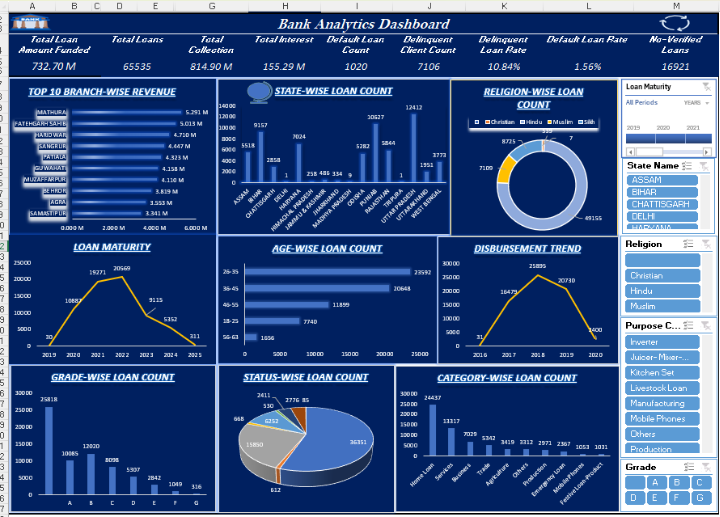
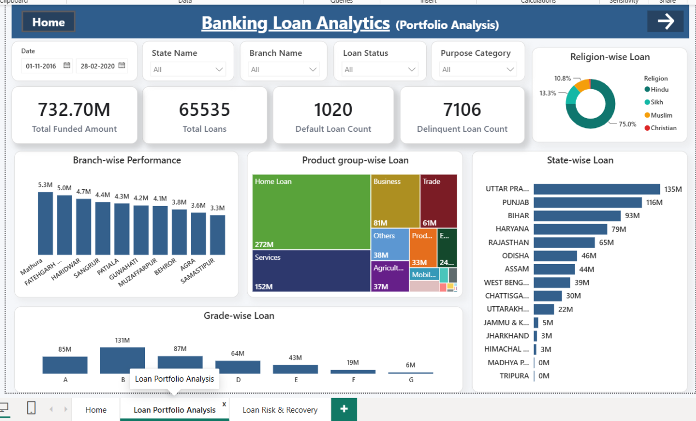
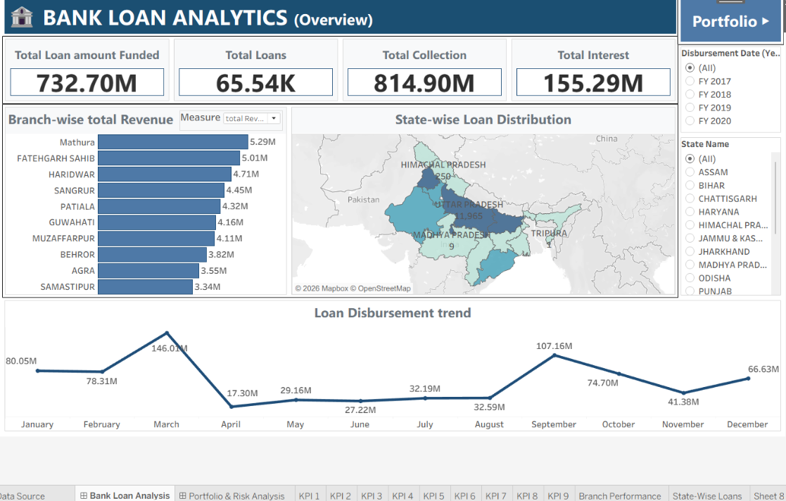
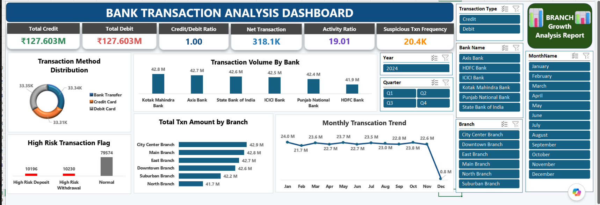
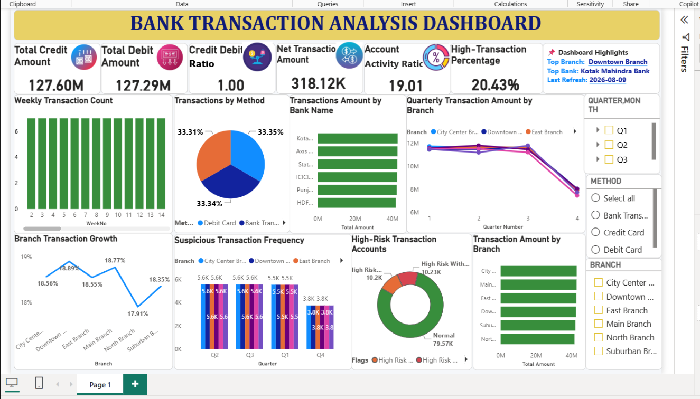
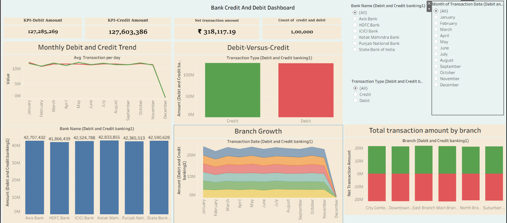

# Bank Analytics Project

## Overview

This project analyzes two banking datasets to identify business trends, customer insights, transaction patterns, and key performance indicators (KPIs).

The project covers:

1. **Bank Loan Analytics**
2. **Credit/Debit Card Analytics**

The analysis was performed using **Excel, SQL, Power BI, and Tableau**.

---

## 1. Bank Loan Analytics

The Bank Loan dataset was analyzed to understand loan portfolio performance, customer behavior, loan distribution, collections, interest, defaults, and delinquencies.

### Key Analysis

- Total Loan Amount Funded
- Total Loans
- Total Collection
- Total Interest
- Default Loan Count
- Delinquent Client Count
- Delinquent Loan Rate
- Default Loan Rate
- Branch-wise Revenue
- State-wise Loan Distribution
- Religion-wise Loan Distribution
- Product Group-wise Loan Distribution
- Grade-wise Loan Analysis
- Loan Disbursement Trend
- Loan Status Analysis

### Tools Used

- Excel
- SQL
- Power BI
- Tableau

### Bank Loan Dashboard Screenshots

#### Excel Dashboard



#### Power BI Dashboard



#### Tableau Dashboard



---

## 2. Credit/Debit Card Analytics

The Credit/Debit Card dataset was analyzed to understand transaction behavior, banking activity, transaction trends, branch performance, and high-risk transactions.

### Key Analysis

- Total Credit Amount
- Total Debit Amount
- Credit/Debit Ratio
- Net Transaction Amount
- Account Activity Ratio
- Suspicious Transaction Frequency
- Transaction Method Distribution
- Transaction Volume by Bank
- Branch-wise Transaction Amount
- Monthly Transaction Trend
- High-Risk Transaction Analysis
- Transaction Growth Analysis

### Tools Used

- Excel
- SQL
- Power BI
- Tableau

### Credit/Debit Card Dashboard Screenshots

#### Excel Dashboard



#### Power BI Dashboard



#### Tableau Dashboard



---

## SQL Analysis

SQL was used to clean, analyze, and extract key business metrics from both datasets.

### Bank Loan Analysis
- Calculated key loan performance KPIs.
- Analyzed loan collections and interest.
- Evaluated default and delinquent loans.
- Analyzed loan distribution by branch, state, grade, product group, and other categories.
- Created KPI queries to support dashboard analysis.

### Credit/Debit Card Analysis
- Calculated total credit and debit transaction amounts.
- Analyzed transaction volumes and trends.
- Compared credit vs. debit transactions.
- Analyzed transaction activity by bank and branch.
- Identified high-risk and suspicious transaction patterns.

---

## Key Insights

### Bank Loan Analytics
- Identified high-performing branches based on loan revenue.
- Analyzed loan distribution across states, grades, products, and customer categories.
- Evaluated loan defaults and delinquency to understand portfolio risk.
- Analyzed loan disbursement trends over time.

### Credit/Debit Card Analytics
- Compared credit and debit transaction activity.
- Analyzed transaction trends across banks and branches.
- Evaluated transaction methods and account activity.
- Identified high-risk and suspicious transaction patterns.

---

## Project Workflow

```text
Raw Banking Data
       ↓
Data Cleaning & Preparation
       ↓
SQL
       ↓
KPI & Business Analysis
       ↓
 ┌─────┼─────┐
 ↓     ↓     ↓
Excel Power BI Tableau
       ↓
Dashboard & Insights
```

---

## Conclusion

This project demonstrates an end-to-end data analytics workflow using SQL, Excel, Power BI, and Tableau. The analysis of bank loan and credit/debit card datasets helped identify key business KPIs, transaction trends, loan performance, and risk-related patterns.

The project showcases practical skills in data cleaning, SQL analysis, KPI development, dashboard creation, and business-oriented data visualization.
